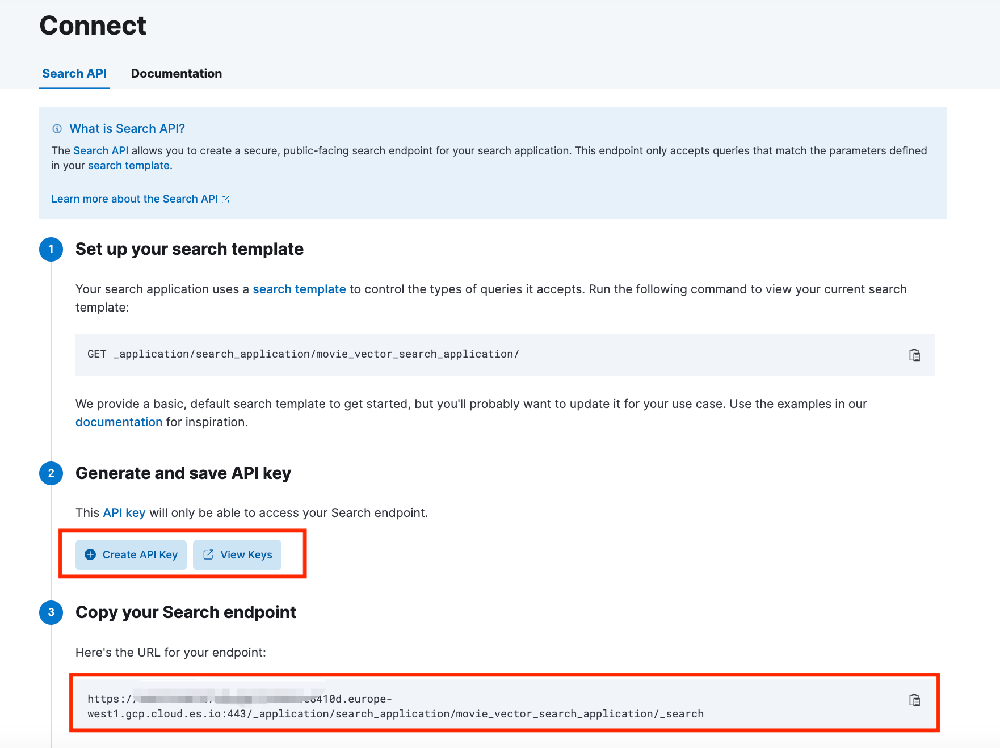

# Vector search application
This project serves as a demo application for the recipes 
* Implementing semantic search with dense vectors
* Implementing semantic search with sparse vectors
* Using hybrid search to build advanced search applications

### Getting Started
1. Install dependencies
```
yarn install
```
2. Head to Kibana | Search | Search Applications | movie_vector_search_application | Connect  

Generate an API Key and save it locally
Copy the Search endpoint (just the https://<host>:<port>) part, DO NOT COPY the "/_application/search_application/movie_vector_search_application/_search" part.


3. Cross-Origin Resource Sharing (CORS) settings
To make a search API call from the application, the browser needs to make requests to the Elasticsearch API directly. Elasticsearch supports Cross-Origin Resource Sharing (CORS), but this feature is disabled by default. So, we need to activate it. 
By adding the following settings to elasticsearch.yml.

For your Elastic Cloud deployment, find your deployment on Elastic Cloud, select “Manage”.
Go the Edit page from the deployment menu and select “Manage user settings and extension” next to Elasticsearch

Update the user settings with the following:
```yaml
http.cors.allow-origin: "*"
http.cors.enabled: true
http.cors.allow-credentials: true
http.cors.allow-methods: OPTIONS, HEAD, GET, POST, PUT, DELETE
http.cors.allow-headers: X-Requested-With, X-Auth-Token, Content-Type, Content-Length, Authorization, Access-Control-Allow-Headers, Accept
```

Save changes and this would restart the deployment.

4. Update the SearchApplicationClient params in ```App.tsx``` with the ```Application name```, ```Elasticsearch endpoint```, ```API key``` for your search application.
```javascript
const request = SearchApplicationClient(
  /*Application name*/,
  /*Elasticsearch endpoint*/,
  /*API key*/,
  /*Additional params*/
)
```

5. Start server. This will start the server on port 3000.
```
yarn start
```